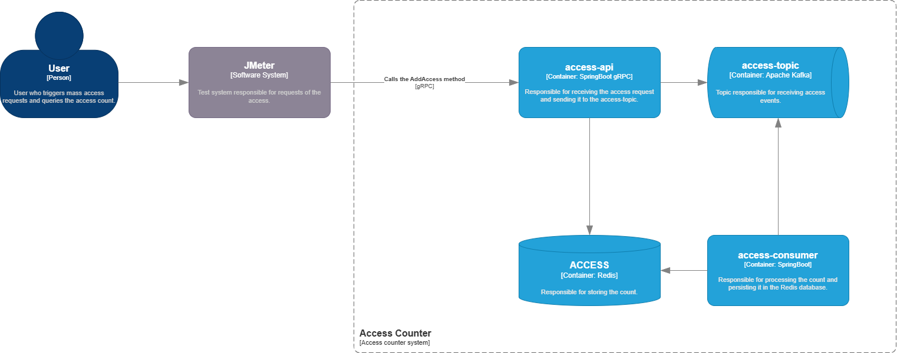

# dock-access-counter-system

Este projeto tem como objetivo realizar o desenvolvimento de um desafio da equipe de Auth da Dock.

## Requisitos
*	Criar o sistema que rode contabilize votos/acessos.
*	Deve rodar em cluster
*	API gRPC
*	Dockerizado
*	Deve receber 1.000.000 de requisições em paralelo de múltiplos usuários e o contador deve bater exatamente 1.000.000.

## Arquitetura

### Diagrama da arquitetura no modelo C4 Level



### access-api

Trata-se de uma API gRPC responsável por receber os acessos, por meio do método ```AddAccess```, e enviá-los ao tópico Kafka para serem contabilizados.

Ela também verifica a quantidade de acessos, e, caso já tenha atigindo o limite, não processa.

#### Tecnologias

| Tecnologia       | Descrição                                                                 |
|------------------|---------------------------------------------------------------------------|
| **gRPC**         | Tipo de comunicação entre serviços de forma rápida, eficiente e tipada.   |
| **Protobuf Plugin** | Gera automaticamente todas as classes necessárias para gRPC.           |
| **Spring Boot**  | Fornece a base da aplicação e gerenciamento de dependências.              |
| **Spring Kafka**        | Usado na produção de mensagens para ingestão de eventos de acessos no Kafka.                  |
| **Redisson**        | Cliente do banco de dados Redis que armazena a contagem de acessos a serem consultados.                   |

#### Payload

O payload é baseado no ```access.proto``` e tem como exemplo:

```json
{
  "clientId": 58217,
  "clientName": "Amanda Segundo",
  "device": {
    "ipAddress": "192.168.12.45",
    "os": "iOS",
    "type": "MOBILE",
    "version": "26"
  },
  "geolocation": {
    "latitude": -26.9189,
    "longitude": -49.0661
  },
  "requestId": "9f722bc0-5b8a-4e52-95e6-182df45fbe4e",
  "timestamp": 1763559532
}

```
#### Respostas

A API pode retornar uma resposta de sucesso ou uma de falha.

##### Sucesso
```json
{
    "success": true,
    "message": ""
}
```

##### Falha
```json
{
    "success": false,
    "message": "Access limit reached, message was not processed."
}
```

### access-consumer

É uma aplicação worker que consome os acessos que estão no tópico Kafka e realiza a contabilização.

#### Tecnologias

| Tecnologia       | Descrição                                                                 |
|------------------|---------------------------------------------------------------------------|
| **Spring Boot**  | Fornece a base da aplicação e gerenciamento de dependências.              |
| **Spring Kafka**        | Usado no consumo de mensagens dos eventos de acessos no Kafka para a contabilização.                  |
| **Redisson**        | Cliente do banco de dados Redis que persiste a contabilização.                   |
| **Jackson Databind** | Usado para converter JSON em objetos Java. |


