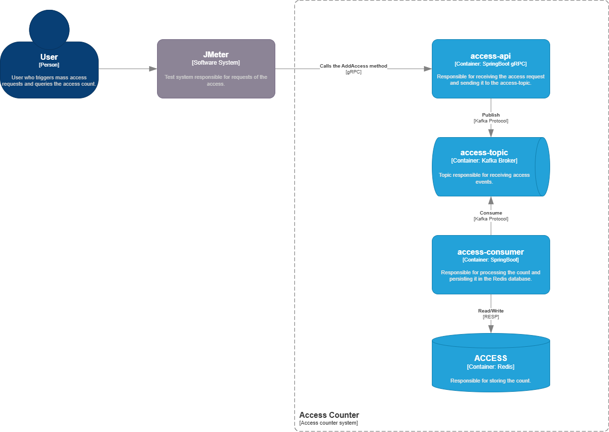

# dock-access-counter-system

Este projeto tem como objetivo realizar o desenvolvimento de um desafio da equipe de Auth da Dock.

## Requisitos
*	Criar o sistema que rode contabilize votos/acessos.
*	Deve rodar em cluster
*	API gRPC
*	Dockerizado
*	Deve receber 1.000.000 de requisições em paralelo de múltiplos usuários e o contador deve bater exatamente 1.000.000.

## Arquitetura

### Diagrama da arquitetura no modelo C4 Level



### Tecnologias

As tecnologias foram escolhidas baseando-se nas tecnologias utilizadas nos projetos da própria Dock.

| Tecnologia       | Descrição |
|------------------|-----------|
| gRPC | Tipo de comunicação entre serviços de forma rápida, eficiente e tipada.|
| Spring Boot | Framework que fornece a base da aplicação, gerenciamento de dependências e suporte a testes unitários e de integração.|
| Kafka | Plataforma de streaming utilizada para produção e consumo de mensagens, permitindo a ingestão de eventos de acesso de forma assíncrona e escalável.|
| Redis | Banco de dados em memória utilizado para armazenar e consultar a contagem de acessos.|
| Podman | Utilizado como ferramenta de orquestração local para execução do ambiente em contêineres, permitindo simular múltiplos serviços de forma simples, como alternativa ao Kubernetes.|
| NGINX | Load balancer utilizado para distribuir as requisições entre as instâncias do serviço de API, evitando sobrecarga em uma única instância.|


### access-api

Trata-se de uma API gRPC responsável por receber os acessos, por meio do método ```AddAccess```, e enviá-los ao tópico Kafka para serem contabilizados.

#### Payload

O payload é baseado no ```access.proto``` e é o mesmo enviado ao tópico ```access-topic```, tem como exemplo:

```json
{
  "clientId": 58217,
  "clientName": "Amanda Segundo",
  "device": {
    "ipAddress": "192.168.12.45",
    "os": "iOS",
    "type": "MOBILE",
    "version": "26"
  },
  "geolocation": {
    "latitude": -26.9189,
    "longitude": -49.0661
  },
  "requestId": "9f722bc0-5b8a-4e52-95e6-182df45fbe4e",
  "timestamp": 1763559532
}

```
#### Respostas

A API pode retornar uma resposta de sucesso ou uma de falha.

##### Sucesso

```json
{
    "success": true,
    "message": "Message processed successfully."
}
```

##### Falha

```json
{
    "success": false,
    "message": "Error processing message."
}
```

### access-consumer

É uma aplicação worker que consome os acessos que estão no tópico ```access-topic```.

Ela realiza a contabilização por meio de um script na linguagem Lua que, atua diretamente no servidor Redis, tornando a operação atômica afim de eliminar problemas de concorrência.

## Escalabilidade

Foram utilizadas **10 instâncias do serviço de API** para suportar um alto volume de requisições concorrentes, permitindo a absorção de picos de entrada sem degradação do serviço.

O **serviço consumidor** foi escalado para **3 instâncias**, considerando que o processamento realizado é simples e rápido, além de estar alinhado ao número de partições do tópico Kafka, garantindo paralelismo máximo no consumo das mensagens sem gerar instâncias ociosas.

## Docker Compose

O projeto e as tecnologias consumidas estão em containers e foi utilizado o Docker Compose.

Recomenda-se utilizar o Podman para executar.

### Comandos úteis

| Comando                               | Descrição                                                              |
|---------------------------------------|------------------------------------------------------------------------|
| `podman machine start`                | Inicia a máquina virtual do Podman.                                    |
| `podman compose down -v`              | Derruba todos os containers e remove volumes associados.               |
| `podman compose up -d --build --scale access-api=10 --scale access-consumer=3`        | Sobe os containers em modo detached, reconstruindo as imagens antes.   |

#### Clients

São utilizados os clients abaixos para consultar os dados envolvidos no sistema:

#### Kafka UI

Interface web para visualizar tópicos, mensagens, consumers e configs do Kafka.

##### Endereço

http://localhost:8090/

#### Redis Insight

Interface gráfica para explorar dados, chaves e estatísticas do Redis.

##### Endereço

http://localhost:5540/

##### Conexão

É necessário adicionar uma base de dados com a Connection URL igual a ```redis://redis:6379```


